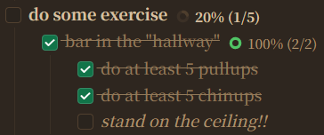
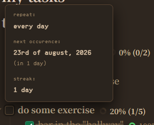
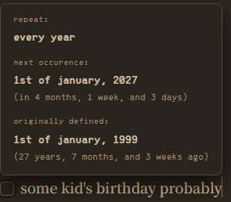
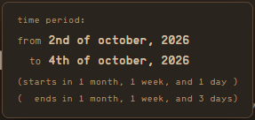

# daily tasks manager thing


> "A zero mess task scheduler and recurrence plugin for Obsidian daily and periodic notes."


is what i WOULD say if i was going to feed you PR slop


basically is a very cool task manager ish thing i made because why not

it works with templater and also periodic notes probably i dont use periodic notes on a daily basis so any problems lmk ig

also it basically replaces that uh goaltodo plugin which is really cool which is why i added it built in (mainly to declutter but yk)


my website is at https://devicals.github.io/ btw


**important you must read literally EVEYRTHING or else you will probably think it doesnt work when you're just stupid**

**like ESPECIALLY the templater part like you basically kind of need templater to use this shit**


also this stuff kind of doesnt work in reading view womp womp MAYBBBEE ill add it maybe i wont it shall depend

i originally made this plugin for my own needs but i decided why not let everyone use it maybe people will use it maybe no one will use this ¯\\\_(ツ)\_/¯


also before all the more like juicy things one small yet big thing it does is carry over your uncompleted tasks to the next day so YEAH!!


# WHAT'S NEW??

- added time periods (e.g. `:: from 2 oct to 4 oct ::`)
- added more natural expressions (e.g. `:: this monday to next friday ::`)
- `data.json` now autoclears non-existing tasks every 12 hours (customizable) to stop wasting space (alth it wont take up much space anyway)
- bug fixes
    - fixed bug where "renaming" a task would make the plugin lose track of it and therefore the task's schedule would be gone

# WHAT'S NEXT??

- probably add a purge button to purge all task schedules before a certain date or during a certain time period


# before i tell you how to use this here are some cool screenshots :)









# anyway so how do you even use this


so basically at the end of a task like you can define when you want this task to come back again

so you write like `:: something here ::` to tell it stuff it works with english so if you dont speak english, lmk and i'll add- SIKE NO TOO BAD IM NOT PUTTING MORE EFFORT INTO THIS THING


anyway instead of telling you what the format is ill just show you a few things


```markdown
- [ ] some task i do every week :: every week ::
- [ ] another task i do every week :: weekly ::
- [ ] i need to this thing in 5 days :: in 5 days ::
- [ ] would you look at that i need to call someone about their car insurance in 7 months and 3 years exactly :: in 7 months and 3 years ::
- [ ] daily thing ig :: daily ::
- [ ] heres a thing i want to do every month but only starting like after tomorrow :: repeat monthly & after tomorrow ::
- [ ] heres a thing i only do every year but i want to do it in 3 days as well :: every 1 year & next in 3 days ::
- [ ] your average tuesday :: every tuesday ::
```


ok theres a bunch of other ways you can phrase all of these but you get it right

also the `:: thing ::` will disappear once you type the closing `::` and you can hover over the checkbox to see like it will tell you when it repeats, the next time you get this task, and if you for some reason wrote like `:: every dd/mm/yyyy ::` or like well you can do day of month of year but anyway so if you hve it repeat and also it has the year, it will also tell you "originally defined" as date and so like i made this to keep track of people's birthdays but maybe theres other use cases idk and idc


also you can clear it by like right clicking on your note and choosing the clear scheduled tasks or going into the plugin settings there yeah

if you want to clear the schedule for a specific task just write `:: clear ::` or remove or whatever most of them should work and also you can redefine them by just well writing your new scheudule wow so intuitive give me praise


## snoozing a task


I DONT WANT TO DO THESE THINGS TODAY


```markdown
- [ ] call the insurance people :: snooze 3 days ::
- [ ] respond to that email :: snooze tomorrow ::
- [ ] ugh :: snooze ::
```


problem solved


## task period


event that lasts for multiple days?


```markdown
- [ ] [Cubed!Con 2026](cubedcon.com) :: in 2 oct to 4 oct ::
- [ ] boss goes on vacation so we can chill and do nothing all week :: from today to next monday ::
```


voila!


## IM ON FIRE SOMEBODY CALL THE FIREFIGHTERS


if a task repeats `:: daily ::` and you actually keep completing it (great job, you still probaby dont have more willpower than an ant), the plugin now counts how many days in a row youve checked it off, and it'll show up in the hover tooltip as like "streak: 12 days". miss a day and it resets to 0. no rewards or anything im not gamifying your life, its just a number to look at

(look at it its so beautiful gaze into the abyss i mean just look isnt it so wonderful you did this thing a whole 0 times)


## some other stuff


optional basically `:: optional ::` and `:: required ::` to switch between optional and normal task

you can do like `:: & next (param) ::` or like use `and` with other components (maybe `repeat` maybe other stuff) to like only change that one paramater and not overwrite everything


# settings


open the plugin settings and theres now a "Daily Notes Folder Override" field. if you dont use obsidian's core Daily Notes plugin or Periodic Notes, or you just want to be extra sure some random unrelated note in your vault never gets mistaken for a daily note and screws up your rollover, set your folder here explicitly. leave it blank and it'll just use whatever Daily Notes/Periodic Notes is already configured with


also yes it works on mobile now, i turned off desktop-only. lmk if something breaks over there i genuinely dont test on mobile (actually dont tell me, screw you (actually tell me im sorry im not a jerk i promise))


**heads up:** hovering to see the schedule tooltip only fully works on tasks that are inside your actual Daily Notes / Periodic Notes folder (whatever you've told Obsidian's core Daily Notes plugin, or Periodic Notes, that folder is). Random notes elsewhere in your vault are ignored on purpose now, so they can't accidentally get treated as a "previous day" and mess up rollover.

(also this time actually fuck you mobile users you cant hover... wait idk if you hover by like long pressing on the checkbox??? idk bro but idc)


# right i also said it works with templater


basically for this whole plugin to even work you will need templater and so like first of all you need to tell the plugin what section of your note is going to be the like your tasks and what is your planned tasks


so go to any heading like the heading you want your tasks to be in and on that heading you write at the end `:: tasks ::`

and where you want to use to plan your tasks write `:: planned ::`

oh and you will need to add these to your headings in templater and then when templater makes your note it will keep it basically


ok and dont you dare define any more than just htose too cuz then the plugin will be confused and it will probably self detruct and send you an airstrike


anyway go into templater and so for the contents of those two sections just use


`<% await tasks.now(tp.file.title) %>` for your tasks and `<% await tasks.planned(tp.file.title) %>` for where you want to see your planned tasks

(i just use `(tp)` and not the whole thing because much simpler also teleportation is cool)


**you need actual parentheses with something in them**

`tasks.now(tp)` or `tasks.now(tp.file.title)` both work fine, the plugin unwraps either one. what does NOT work is just `tasks.now` on its own with no `()` at all - that means Templater never actually calls the function, it just dumps the raw function code into your note as text, which looks broken and is broken. ask me how i know.


ok u got that? ok good now if anything mess up come back here and make sure it wasn't just your own incompetence first


# oh hey goaltodo what even is that


if you dont know what it does basically like its like a task hierarchy thing so like if you tick off all the subtasks of a task that task autoamtically gets ticked off and theres like a nice little progress percentage next to the parent task and a X/Y counter and also i really love how the checkbox also is a progress eh circle but i couldnt make that i guess anyway the only thing not included is the checkered flag for "goal" tasks (parent tasks)


oh and theres some other stuff i probably forgot about but thats the whole gist of it

# credits and info or sth

entirely made by i, me, and myself (error dev)

tested in live preview mode only

if you use this like if you fork this or something you have to give me credit for the original work